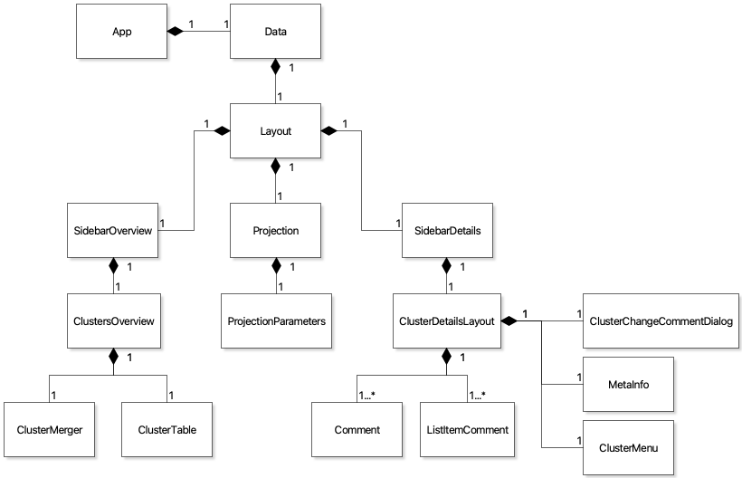

# Interactive Visualization Interface for Text Exploration and Annotation

This project was created for my bachelor thesis. It builds on top of the [UMAP Explorer](https://github.com/GrantCuster/umap-explorer) by Grant Custer and was used as a prototype to elicit explanation needs of users. To find out more, check out the [thesis](thesis/thesis_main.pdf).

[Click here](https://defo10.github.io/interface-for-text-exploration-and-annotation/) to check out the prototype.

## A rough guide to the code

The demo app is a React app. It uses `src/Data.js` to fetch the data and `src/Layout.js` to handle the layout of the page. The three.js visualization code is in `src/Projection.js`. The data is available as json files in the `public` folder. The data was created using a text processing pipeline developed at HCI lab of FU Berlin.

## Viewing the demo page

Open [https://defo10.github.io/interface-for-text-exploration-and-annotation/](https://defo10.github.io/interface-for-text-exploration-and-annotation/)

## Running the app locally

This project was bootstrapped with [Create React App](https://github.com/facebook/create-react-app).

In the project directory, you can run:

### `npm start`

Runs the app in the development mode. 
Open [http://localhost:3000](http://localhost:3000) to view it in the browser.

The page will reload if you make edits. 
You will also see any lint errors in the console.

### `npm run build`

Builds the app for production to the `build` folder. 
It correctly bundles React in production mode and optimizes the build for the best performance.

The build is minified and the filenames include the hashes. 
Your app is ready to be deployed!

See the section about [deployment](https://facebook.github.io/create-react-app/docs/deployment) for more information.

### Learn more about create react app

You can learn more in the [Create React App documentation](https://facebook.github.io/create-react-app/docs/getting-started).

To learn React, check out the [React documentation](https://reactjs.org/).
